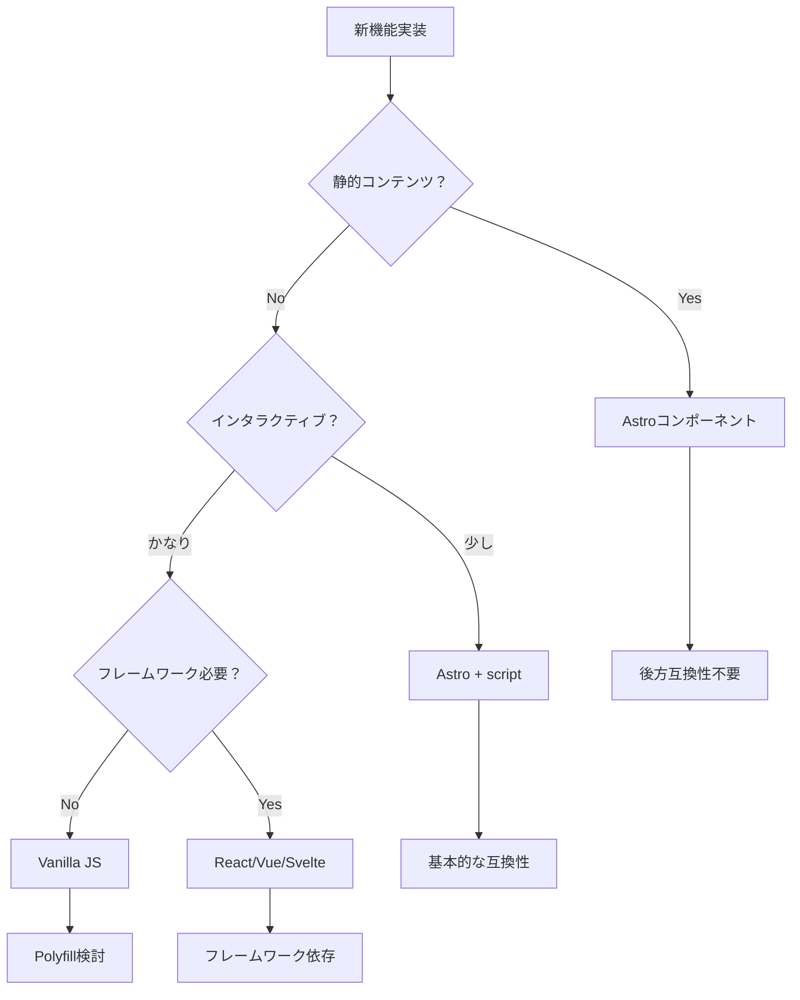

# Astro実装方針ガイド

## 基本方針：Astro優先 + HTML/CSS最大限活用

### なぜAstro優先なのか

1. **統一性**
   - プロジェクト全体でAstroを使用している
   - コンポーネントの再利用性が高い
   - メンテナンスが容易

2. **パフォーマンス**
   - ビルド時に最適化される
   - 不要なJavaScriptを削減
   - 自動的なコード分割

3. **開発効率**
   - TypeScriptサポート
   - HMR（ホットモジュールリプレイスメント）
   - 統合された開発環境

4. **HTML/CSS活用の利点**
   - デザイナー（ひさな）のHTML/CSSをそのまま使用可能
   - 実装工数の大幅削減（最大57%）
   - デザイン意図の完全再現

## 後方互換性の考え方

### 現実的な対応範囲

```yaml
# ブラウザサポート目標
modern_browsers:
  chrome: 90+      # 2021年5月以降
  edge: 90+        # 2021年5月以降
  firefox: 88+     # 2021年4月以降
  safari: 14+      # 2020年9月以降

# 実質的なシェア
coverage: 95%以上のユーザーをカバー
```

### Astroのデフォルト対応

```javascript
// astro.config.mjs
export default defineConfig({
  // Astroは自動的にモダンブラウザ向けに最適化
  vite: {
    build: {
      target: 'es2020' // デフォルト設定
    }
  }
});
```

## 実装判断フローチャート



## 具体的な実装例

### 1. カルーセル実装の場合

```astro
---
// ✅ 推奨：Astroコンポーネント
import Carousel from '../components/Carousel.astro';
---

<Carousel slides={data} />

<!-- 後方互換性対策 -->
<noscript>
  <!-- JavaScriptなしでも最低限見える -->
  <div class="carousel-fallback">
    {data.map(slide => (
      
    ))}
  </div>
</noscript>
```

### 2. マウスカーソルの場合

```astro
---
// 機能検出で段階的強化
---

<script>
  // モダンブラウザのみカスタムカーソル
  if ('CSS' in window && CSS.supports('cursor', 'none')) {
    import('../scripts/custom-cursor.js');
  }
</script>

<style>
  /* フォールバック */
  body {
    cursor: url('/cursors/custom.png'), auto;
  }
  
  /* モダンブラウザ向け */
  @supports (cursor: none) {
    body {
      cursor: none;
    }
  }
</style>
```

## プログレッシブエンハンスメント戦略

### レベル1：基本機能（全ブラウザ）
```html
<!-- 静的HTML -->
<div class="gallery">
  
  
</div>
```

### レベル2：CSS拡張（モダンCSS対応）
```css
/* Grid対応ブラウザで改善 */
@supports (display: grid) {
  .gallery {
    display: grid;
    grid-template-columns: repeat(auto-fit, minmax(200px, 1fr));
  }
}
```

### レベル3：JavaScript強化（ES6+対応）
```javascript
// 動的インポートで必要時のみ読み込み
if ('IntersectionObserver' in window) {
  const { initLazyLoad } = await import('./lazy-load.js');
  initLazyLoad();
}
```

## 後方互換性チェックリスト

### 必須対応
- [ ] 基本的なHTML構造で情報が伝わる
- [ ] CSSなしでも読める
- [ ] JavaScriptなしでも操作可能

### 推奨対応
- [ ] キーボード操作
- [ ] スクリーンリーダー対応
- [ ] 低速回線での表示

### オプション対応
- [ ] IE11対応（2022年6月サポート終了）
- [ ] 古いモバイルブラウザ
- [ ] JavaScript無効環境

## 実装優先順位

```typescript
// 1. Astroコンポーネントで実装
<Component />

// 2. 必要に応じてインタラクティブ機能追加
<Component client:visible />

// 3. 後方互換性は機能検出で対応
if (supportsFeature()) {
  enhanceExperience();
}
```

## パフォーマンス影響

### Polyfillのコスト
```javascript
// ❌ 避けるべき：大量のPolyfill
import 'core-js/stable';
import 'regenerator-runtime/runtime';

// ✅ 推奨：必要最小限
if (!window.IntersectionObserver) {
  import('intersection-observer');
}
```

### バンドルサイズ比較
```
完全互換対応: ~150KB
モダンのみ:    ~50KB
差分:         100KB（初回読み込み2-3秒増）
```

## 判断基準まとめ

### Astro優先すべきケース（90%）
- 新規実装
- 一般的なWebサイト
- B2C向けサービス
- SEO重視のサイト

### 後方互換性を重視すべきケース（10%）
- 官公庁・教育機関向け
- 高齢者向けサービス
- 発展途上国向け
- 企業の社内システム

## 実装推奨事項

1. **デフォルトはAstro優先**
   - シンプルで保守しやすい
   - パフォーマンスが良い

2. **段階的強化を採用**
   - 基本機能は全員に提供
   - 拡張機能は対応ブラウザのみ

3. **測定して判断**
   ```javascript
   // アナリティクスでブラウザシェア確認
   if (oldBrowserShare < 5%) {
     // モダンブラウザのみ対応で十分
   }
   ```

## まとめ

**基本方針：Astro優先で実装し、必要に応じて後方互換性対応**

- 95%のケースはAstroのデフォルトで十分
- 特殊な要件がある場合のみ追加対応
- プログレッシブエンハンスメントで段階的に機能追加
- 測定データに基づいて判断

これにより、開発効率とユーザー体験のバランスが取れた実装が可能です。