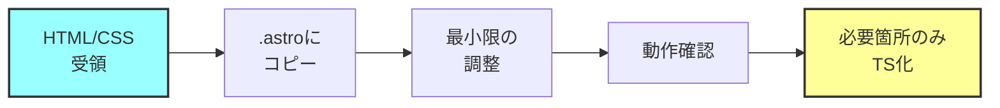

# HTML+CSS→TypeScript変換の必要性検討

## 結論：基本的に不要（部分的には有効）

### なぜ不要か

#### 1. Astroの設計思想
```astro
---
// .astroファイルはHTML+CSS+TSの共存が前提
const { title } = Astro.props;
---

<!-- 普通のHTMLがそのまま書ける -->
<div class="hero">
  <h1>{title}</h1>
</div>

<style>
  /* 普通のCSSがそのまま書ける */
  .hero {
    background: blue;
  }
</style>
```

**Astroは「HTML/CSSファーストのフレームワーク」**

#### 2. 変換の弊害

```typescript
// ❌ 過度なTS化の例
export const HeroStyles = {
  container: {
    background: 'blue',
    padding: '50px'
  }
} as const;

// これより...

// ✅ 素直なCSS
<style>
  .hero {
    background: blue;
    padding: 50px;
  }
</style>
```

**可読性・保守性が低下する**

## 変換が有効なケース

### 1. 動的スタイルが必要な部分のみ

```astro
---
// 動的な値はTSで管理
const primaryColor = '#2c5aa0';
const heroHeight = isMobile ? '50vh' : '80vh';
---

<div class="hero" style={`height: ${heroHeight}`}>
  <!-- content -->
</div>

<style define:vars={{ primaryColor }}>
  .hero {
    background: var(--primaryColor);
  }
</style>
```

### 2. 再利用可能な定数

```typescript
// src/config/styles.ts
export const COLORS = {
  primary: '#2c5aa0',
  secondary: '#f4a261',
} as const;

export const SPACING = {
  section: '80px',
  element: '24px',
} as const;
```

## 推奨アプローチ

### ステップ1：そのまま使う
```
design-html/
├── index.html
├── styles.css
└── images/

↓ 最小限の変換

src/
├── pages/
│   └── index.astro (HTMLをほぼそのまま)
└── styles/
    └── global.css (CSSをそのまま)
```

### ステップ2：必要に応じて部分的にTS化

```astro
---
// 必要な部分だけTypeScript
import { COLORS } from '../config/styles';

interface Props {
  title: string;
}

const { title } = Astro.props;
---

<!-- HTMLは変更不要 -->
<section class="hero">
  <h1>{title}</h1>
</section>

<!-- CSSも基本そのまま -->
<style>
  .hero {
    /* 静的なスタイルはそのまま */
    padding: 50px;
  }
</style>
```

## 具体的な統合フロー

### 1. HTMLを.astroファイルに

```bash
# 単純にコピー&拡張子変更
cp design-html/index.html src/pages/index.astro
```

### 2. 最小限の調整

```diff
+ ---
+ import Layout from '../layouts/Layout.astro';
+ ---
+ 
+ <Layout>
  <!DOCTYPE html>
  <html>
  <head>
-   <link rel="stylesheet" href="styles.css">
  </head>
  <body>
    <!-- existing HTML -->
  </body>
  </html>
+ </Layout>
+ 
+ <style>
+   @import url('./styles.css');
+ </style>
```

### 3. 段階的なコンポーネント化

```astro
---
// 繰り返し使う部分だけコンポーネント化
import ServiceCard from '../components/ServiceCard.astro';

const services = [
  { title: "科学実験ショー", icon: "🧪" },
  { title: "出張授業", icon: "🚀" },
];
---

<!-- 静的な部分はHTMLのまま -->
<section class="services">
  <h2>サービス一覧</h2>
  <div class="service-grid">
    {services.map(service => (
      <ServiceCard {...service} />
    ))}
  </div>
</section>
```

## CSS-in-TS vs 通常のCSS

### ❌ 避けるべきパターン

```typescript
// styled-components風
const HeroContainer = styled.div`
  background: blue;
  padding: 50px;
`;

// CSS-in-JSオブジェクト
const styles = {
  hero: {
    background: 'blue',
    padding: '50px'
  }
};
```

### ✅ 推奨パターン

```astro
<!-- Astroコンポーネント内 -->
<style>
  /* 普通のCSS */
  .hero {
    background: var(--color-primary);
    padding: var(--spacing-hero);
  }
  
  /* PostCSSも使える */
  .card {
    @apply rounded-lg shadow-md;
  }
</style>
```

## コスト・工数への影響

### 不要な変換をした場合
- HTML→TS変換: +5時間
- CSS→TS変換: +8時間
- デバッグ・調整: +5時間
- **無駄な工数: 18時間**

### 推奨アプローチの場合
- .astroへの移行: 2時間
- 必要な部分のみTS化: 3時間
- **実質工数: 5時間**

## 結論とアクションプラン

### DO ✅
1. **HTMLはそのまま.astroファイルに**
2. **CSSはそのままstyleタグに**
3. **必要な部分だけTypeScript化**
   - Props定義
   - 動的データ
   - 設定値の一元管理

### DON'T ❌
1. **全てをTypeScript化しない**
2. **CSS-in-JSにしない**
3. **過度に抽象化しない**

### 実装手順


## まとめ

**HTML+CSS → TSへの全面変換は不要です！**

理由：
- Astroは元々HTML/CSSフレンドリー
- 変換は工数の無駄
- 保守性が下がる

**やるべきこと：**
- デザイナーのHTML/CSSを尊重
- 最小限の調整で統合
- 動的な部分だけTS化

これにより、デザイナーの意図を保ちつつ、効率的に開発できます。