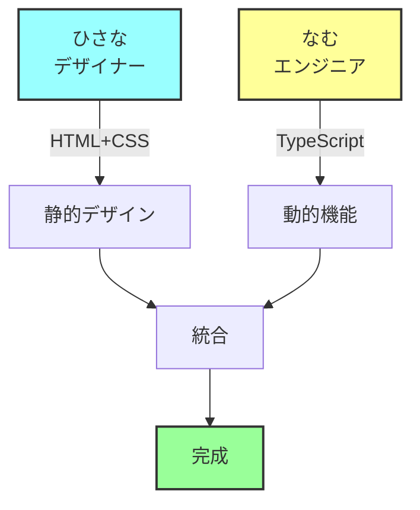
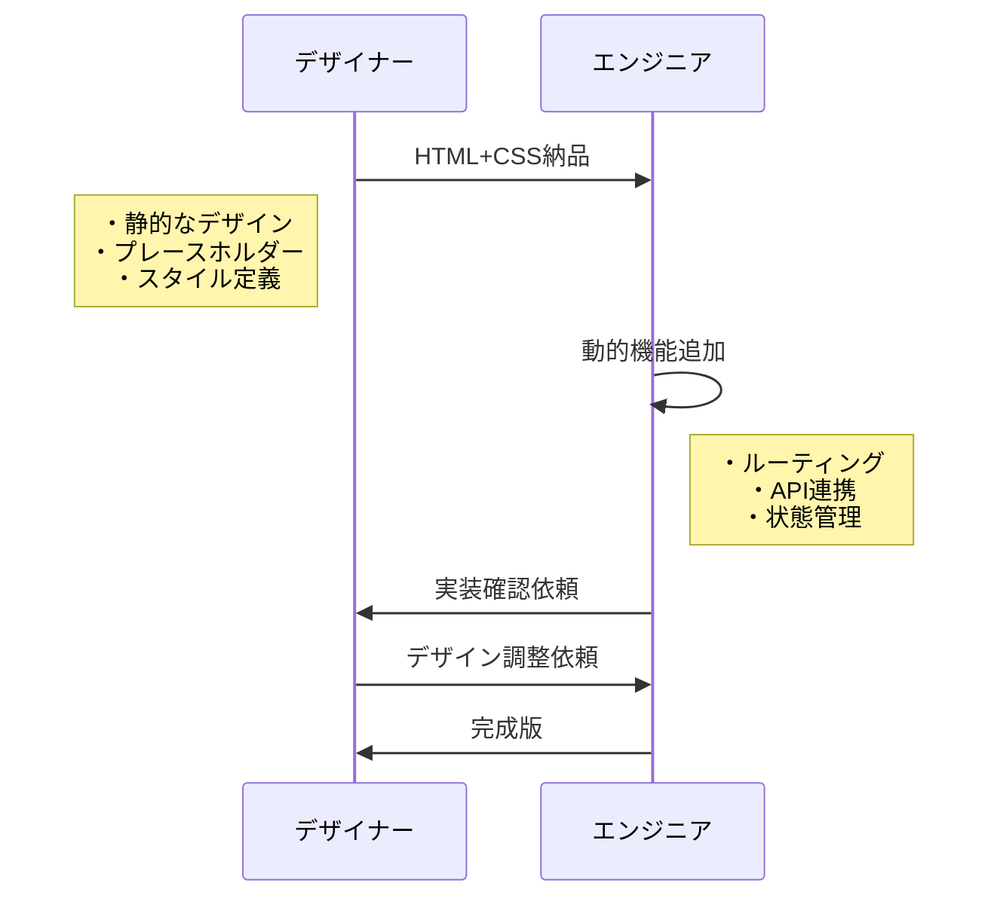

# HTML+CSS vs TypeScript 役割分担ガイド

## DONATIプロジェクトの実装方針
- **デザイナー（ひさな）**: HTML/CSS担当 → 静的デザイン
- **エンジニア（なむ）**: TypeScript担当 → 動的機能のみ
- **クライアント（フジ）**: 科学実験コンテンツ提供

## 明確な役割分担

### 🎨 HTML+CSSで完結できること（デザイナー領域）

```html
<!-- 静的な見た目の部分 -->
<section class="hero">
  <h1>サイエンス アンド スペース ラボ DONATI</h1>
  <p>科学の楽しさを、すべての人に</p>
  <button class="cta-button">お問い合わせ</button>
</section>

<style>
  .hero {
    background: linear-gradient(...);
    padding: 80px;
  }
  
  .cta-button {
    background: #f4a261;
    transition: transform 0.3s;
  }
  
  .cta-button:hover {
    transform: scale(1.05);
  }
</style>
```

**できること：**
- ✅ レイアウト・デザイン
- ✅ 色・フォント・余白
- ✅ ホバーエフェクト
- ✅ CSSアニメーション
- ✅ レスポンシブデザイン

### ⚙️ TypeScriptが必要な部分（エンジニア領域）

#### 1. ルーティング制御
```typescript
// Astroの動的ルーティング
// src/pages/news/[slug].astro
---
export async function getStaticPaths() {
  const posts = await fetchNewsFromMicroCMS();

  return posts.map(post => ({
    params: { slug: post.slug },
    props: { post }
  }));
}

const { post } = Astro.props;
---

<h1>{post.title}</h1>
<div>{post.content}</div>
```

**注記**: 現在、動的ルーティングは未使用です。ニュースページは static な実装に向けて計画中です。

#### 2. Instagram連携
```typescript
// src/lib/instagram-rss.ts
export async function fetchInstagramPosts() {
  try {
    const response = await fetch(RSS_URL);
    const xml = await response.text();
    const posts = parseXML(xml);

    // キャッシュ処理
    await cache.set('instagram_posts', posts);

    return posts;
  } catch (error) {
    // エラーハンドリング
    return cache.get('instagram_posts') || [];
  }
}
```

**現状**: InstagramSectionコンポーネントは Instagram 公式ウィジェットを使用しています。RSS 連携は `experiments/instagram-rss-sample/` に実装済みですが、本番統合は保留中です。

#### 3. 状態管理・インタラクション
```typescript
// クライアントサイドの動的処理
<script>
  const menuButton = document.querySelector('.menu-button');
  const mobileMenu = document.querySelector('.mobile-menu');
  
  menuButton?.addEventListener('click', () => {
    mobileMenu?.classList.toggle('active');
  });
</script>
```

## 実装パターン別の分担

### パターン1: 完全分離型（推奨）



**実装例：**
```astro
---
// エンジニアが追加する部分
import { fetchInstagramPosts } from '../lib/instagram-rss';
const posts = await fetchInstagramPosts();
---

<!-- デザイナーのHTMLをそのまま使用 -->
<section class="instagram-feed">
  <h2>最新の活動</h2>
  <div class="posts-grid">
    {posts.map(post => (
      <!-- エンジニアが動的部分を埋め込み -->
      <article class="post-card">
        
        <h3>{post.title}</h3>
        <p>{post.description}</p>
      </article>
    ))}
  </div>
</section>

<!-- デザイナーのCSSはそのまま -->
<style>
  .instagram-feed { /* デザイナーのスタイル */ }
  .posts-grid { /* デザイナーのスタイル */ }
  .post-card { /* デザイナーのスタイル */ }
</style>
```

### パターン2: プレースホルダー型

**デザイナーが用意：**
```html
<!-- 静的なモックアップ -->
<section class="instagram-feed">
  <h2>最新の活動</h2>
  <div class="posts-grid">
    <!-- プレースホルダー -->
    <article class="post-card">
      
      <h3>楽しい科学実験を開催しました！</h3>
      <p>子どもたちと一緒に...</p>
    </article>
    <!-- 3-4個のサンプル -->
  </div>
</section>
```

**エンジニアが変換：**
```astro
---
const posts = await fetchInstagramPosts();
---

<!-- 構造は維持、データだけ動的に -->
<section class="instagram-feed">
  <h2>最新の活動</h2>
  <div class="posts-grid">
    {posts.length > 0 ? (
      posts.map(post => (
        <article class="post-card">
          
          <h3>{post.title}</h3>
          <p>{post.description}</p>
        </article>
      ))
    ) : (
      <!-- エラー時はデザイナーのプレースホルダーを表示 -->
      <article class="post-card">
        
        <h3>最新情報を取得中...</h3>
        <p>しばらくお待ちください</p>
      </article>
    )}
  </div>
</section>
```

## 機能別の実装責任者

| 機能 | HTML+CSS（デザイナー） | TypeScript（エンジニア） |
|------|----------------------|------------------------|
| ページレイアウト | ✅ 全体のデザイン | ✅ レイアウトコンポーネント化 |
| ナビゲーション | ✅ 見た目・配置 | ✅ ルーティング設定 |
| Instagram表示 | ✅ カードデザイン | ✅ データ取得・表示ロジック |
| お問い合わせ | ✅ フォームデザイン | ✅ 送信処理・バリデーション |
| アニメーション | ✅ CSSアニメーション | ✅ スクロール連動など |
| エラー表示 | ✅ エラー画面デザイン | ✅ エラーハンドリング |

## 実装フロー



## コード例：Instagram連携の完全実装

```astro
---
// src/components/InstagramFeed.astro
import type { InstagramPost } from '../types';
import { fetchInstagramPosts } from '../lib/instagram-rss';

// TypeScriptでデータ取得
const posts = await fetchInstagramPosts();
const displayPosts = posts.slice(0, 6); // 最新6件
---

<!-- デザイナーのHTML構造を維持 -->
<section class="instagram-feed">
  <div class="container">
    <h2 class="section-title">
      <span class="icon">📸</span>
      最新の活動
    </h2>
    
    <div class="posts-grid">
      {displayPosts.map((post) => (
        <article class="post-card" data-post-id={post.id}>
          <a href={post.link} target="_blank" rel="noopener">
            <div class="post-image">
              
            </div>
            <div class="post-content">
              <h3>{post.title}</h3>
              <p>{post.description}</p>
              <time>{new Date(post.date).toLocaleDateString('ja-JP')}</time>
            </div>
          </a>
        </article>
      ))}
    </div>
    
    {posts.length === 0 && (
      <div class="no-posts">
        <p>現在、投稿を取得できません。</p>
      </div>
    )}
  </div>
</section>

<!-- デザイナーのCSSをそのまま使用 -->
<style>
  /* デザイナーが定義したスタイル */
  .instagram-feed {
    padding: 80px 0;
    background: #f8f9fa;
  }
  
  .posts-grid {
    display: grid;
    grid-template-columns: repeat(auto-fit, minmax(300px, 1fr));
    gap: 24px;
  }
  
  .post-card {
    background: white;
    border-radius: 12px;
    overflow: hidden;
    transition: transform 0.3s;
  }
  
  .post-card:hover {
    transform: translateY(-4px);
  }
</style>

<script>
  // 必要に応じてクライアントサイドの処理
  document.querySelectorAll('.post-card').forEach(card => {
    card.addEventListener('click', (e) => {
      // アナリティクス送信など
      console.log('Instagram post clicked:', card.dataset.postId);
    });
  });
</script>
```

## まとめ

### デザイナー（HTML+CSS）の責任範囲
- 🎨 見た目・レイアウト・スタイル
- 🎨 静的なコンテンツ構造
- 🎨 ホバー・トランジション効果

### エンジニア（TypeScript）の責任範囲
- ⚙️ ルーティング・ページ生成
- ⚙️ 外部API連携（Instagram等）
- ⚙️ データ取得・エラー処理
- ⚙️ 動的なインタラクション

**重要：デザイナーのHTML+CSSは最大限活かしつつ、動的機能だけTypeScriptで追加する**のが最も効率的です。