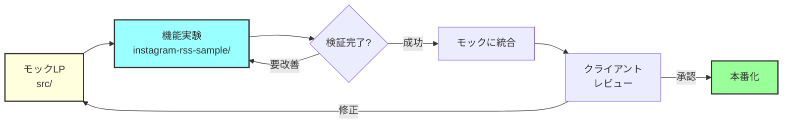

# プロジェクト構成ガイド（モック開発段階）

## 現状の理解

- メインのLPデザイン自体がモック段階
- `instagram-rss-sample/` は機能検証用の実験
- 本番環境はまだ存在しない

## 推奨されるモック段階のプロジェクト構成

### 現在の構成（モック開発中）

```
donati-website/
├── src/                           # モックLP実装
├── public/                        # モック用アセット
├── instagram-rss-sample/          # Instagram機能の実験
└── experiments/                   # その他の実験（必要に応じて）
```

**この構成の妥当性：**
- ✅ モック段階では現在の構成で問題なし
- ✅ instagram-rss-sampleは重要な機能検証
- ✅ 本番移行時に整理すれば良い

### 本番移行時の推奨構成

```
donati-website/
├── src/                           # 本番コード
│   ├── components/
│   │   └── InstagramFeed.astro   # 実験から移行
│   └── lib/
│       └── instagram-rss.ts      # 実験から移行
├── public/
├── design/
└── archive/                       # 不要な実験をアーカイブ
    └── experiments/
```

## 現段階での推奨アプローチ

### 1. そのまま進める（推奨）

```
donati-website/（モック）
├── src/                     # モックLP
├── instagram-rss-sample/    # 機能実験
└── その他必要なファイル
```

**理由：**
- モック段階では柔軟性が重要
- 頻繁にファイルを参照・修正する
- 過度な整理は開発速度を落とす

### 2. 軽い整理のみ

```bash
# READMEで現状を明確化
cat >> README.md << 'EOF'

## プロジェクト構成
- `/src` - モックLP実装
- `/instagram-rss-sample` - Instagram RSS連携の実験実装
- 本番移行時に構成を再整理予定
EOF
```

## モックから本番への移行手順

### フェーズ1: 機能の統合

```bash
# Instagram RSS機能を本番コードに統合
cp instagram-rss-sample/src/lib/instagram-rss.ts src/lib/
cp instagram-rss-sample/src/components/AnnouncementCard.astro src/components/

# 不要な実験ファイルを削除
rm -rf instagram-rss-sample/node_modules
rm -rf instagram-rss-sample/dist
```

### フェーズ2: プロジェクト構成の整理

```bash
# アーカイブディレクトリ作成
mkdir -p archive/experiments

# 実験プロジェクトをアーカイブ
git mv instagram-rss-sample archive/experiments/

# コミット
git commit -m "refactor: Instagram RSS機能を本番に統合、実験をアーカイブ"
```

## .gitignoreへの追加

```gitignore
# 実験プロジェクトのビルド成果物
experiments/**/dist/
experiments/**/node_modules/
experiments/**/.cache/
experiments/**/*.log

# ただし、ソースコードは追跡
!experiments/**/src/
!experiments/**/README.md
```

## モック開発のフロー



## 現段階での注意事項

1. **現在の構成を維持**
   - モック段階では開発速度を優先
   - 過度な整理は避ける

2. **ドキュメント化**
   - 各実験の目的と結果を記録
   - 本番移行時の注意点をメモ

3. **定期的なレビュー**
   - クライアントとの確認
   - 機能の取捨選択

4. **本番移行の準備**
   - 成功した機能のリスト化
   - 不要な実験の識別

## まとめ

モック段階では**現在の構成で問題ありません**。`instagram-rss-sample`はそのままルートに置いておき、本番移行時に適切に整理しましょう。開発の柔軟性と速度を保つことが最優先です。