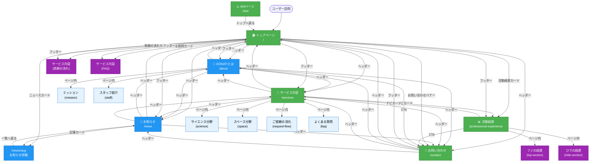

# DONATIサイト 画面遷移図（なむ案）

> **作成日**: 2025年12月27日
> **目的**: シンプルで分かりやすい画面構成により、お問い合わせへの導線とサービス理解のしやすさを実現する

---

## 🎯 方針とか

### 基本方針
1. **シンプル化**: ページ数を最小限に絞り、ユーザーを迷わせない
2. **お問い合わせ導線の強化**: どのページからもスムーズにお問い合わせへ到達
3. **サービス理解のしやすさ**: サービス内容→実績→お問い合わせの自然な流れ

### ページ構成（6ページ）

#### 実装済み（4ページ）
- ✅ `/` - トップページ（入口）
- ✅ `/services` - サービス内容（詳細説明）
- ✅ `/contact` - お問い合わせ（ゴール）
- ✅ `/professional-experience` - 活動経歴（信頼獲得）

#### 新規実装（2ページ）
- 🆕 `/news` - お知らせ一覧・詳細（最新情報）
- 🆕 `/about` - DONATIとは（ブランド理解 + スタッフ紹介統合）

#### 削除・統合
- ❌ `/staff` → `/about` に統合（スタッフ紹介セクションとして）
- ❌ `/achievements` → `/professional-experience` に統合（リンク先を一本化）
- ✅ `/404` - 準備中ページ（維持）

**統合の根拠**: デザイナー（ひさなさ）のモックアップで「DONATIとは」と「私たちについて」が一体化されており、組織のミッション（理念）とスタッフ紹介（人）を同じページで見せる設計。`/about`（パーソナル）と`/professional-experience`（公的実績）で役割を明確に分ける。

---

## 📊 全体サイトマップ



---

## 🏠 トップページ詳細（なむ案）

### 主要な変更点
1. **ヘッダーナビゲーション**: 5項目 → 4項目（シンプル化）
   - DONATIとは、サービス内容、お知らせ、お問い合わせ
2. **ニュースカード**: `/news/[slug]` 詳細ページへの直リンク追加

### 画面遷移図（Mermaid）

```mermaid
graph TD
    Top[🏠 トップページ /] --> Header[ヘッダー]
    Top --> Hero[ヒーローセクション]
    Top --> Carousel[カルーセルセクション]
    Top --> Overview[OverViewセクション]
    Top --> NewsSection[お知らせセクション]
    Top --> Instagram[Instagramセクション]
    Top --> QA[お問い合わせバナー]
    Top --> Footer[フッター]

    %% ヘッダー（4項目にシンプル化）
    Header --> H1[📖 DONATIとは<br/>/about]
    Header --> H2[🎯 サービス内容<br/>/services]
    Header --> H3[📰 お知らせ<br/>/news]
    Header --> H4[📧 お問合せ<br/>/contact]

    %% OverViewセクション
    Overview --> O1["🎯 依頼の流れカード<br/>サービス内容(依頼の流れ)"]
    Overview --> O2["❓ よくある質問カード<br/>サービス内容(FAQ)"]
    Overview --> O3[📊 活動経歴カード<br/>/professional-experience]

    %% お知らせ（詳細ページへ直リンク）
    NewsSection --> N1[ニュース記事1<br/>/news/slug1]
    NewsSection --> N2[ニュース記事2<br/>/news/slug2]
    NewsSection --> N3[ニュース記事3<br/>/news/slug3]
    NewsSection --> N4[ニュース記事4<br/>/news/slug4]
    NewsSection --> NAll[一覧を見る<br/>/news]

    %% お問い合わせバナー
    QA --> Contact[📧 お問い合わせ<br/>/contact]

    %% フッター
    Footer --> F1[📖 DONATIとは<br/>/about]
    Footer --> F2[🎯 サービス内容<br/>/services]
    Footer --> F3["📋 依頼の流れ<br/>サービス内容(依頼の流れ)"]
    Footer --> F4[📊 活動経歴<br/>/professional-experience]
    Footer --> F5["❓ よくある質問<br/>サービス内容(FAQ)"]
    Footer --> F6[📰 お知らせ<br/>/news]
    Footer --> F7[📧 お問い合わせ<br/>/contact]

    classDef implemented fill:#4CAF50,stroke:#2E7D32,color:#fff
    classDef new fill:#2196F3,stroke:#1565C0,color:#fff
    classDef section fill:#E3F2FD,stroke:#1976D2,color:#000

    class H2,H4,O1,O2,O3,Contact,F2,F3,F4,F5,F7 implemented
    class H1,H3,N1,N2,N3,N4,NAll,F1,F6 new
    class Header,Hero,Carousel,Overview,NewsSection,Instagram,QA,Footer section
```



---

## 🆕 これから実装ページ詳細

### `/about` - DONATIとは（スタッフ統合版）

### `/news` - お知らせ一覧

### `/news/[slug]` - お知らせ詳細

---

## ✨ 提案の改善ポイント

### 1. ヘッダーナビゲーションのシンプル化

**変更前（5項目）**:
- DONATIとは、私たちについて、お知らせ、サービス内容、お問合せ

**変更後（4項目）**:
- DONATIとは（スタッフ統合）、サービス内容、お知らせ、お問合せ

**効果**:
- 選択肢が減り、ユーザーが迷わない

---

### 2. お問い合わせ導線の強化

**追加箇所**:
- `/about` ページ下部: お問い合わせCTA
- `/professional-experience` ページ下部: お問い合わせCTA
- `/news/[slug]` 詳細ページ下部: お問い合わせCTA

**既存**:
- トップページ: お問い合わせバナー
- ヘッダー: お問い合わせリンク（全ページ共通）
- フッター: お問い合わせリンク（全ページ共通）

**効果**:
- どのページからもスムーズにお問い合わせへ誘導
- コンバージョン率の向上

---

### 3. サービス理解の流れ改善

**理想的なユーザージャーニー**:

```
1. トップページ（入口）
   ↓
2. サービス内容（詳細理解）
   ↓
3. 活動経歴（信頼獲得）
   ↓
4. お問い合わせ（コンバージョン）
```

**実装方法**:
- サービスページ → 活動経歴へのナビゲーションカード
- 活動経歴ページ → お問い合わせCTA
- 各ページにスムーズな導線を設置

---

## 💡 次のステップ

### デザイナー確認事項
1. `/about` ページのデザイン方向性
2. `/news` 一覧・詳細ページのレイアウト
3. CTAデザインの統一方針

### コンテンツ準備
1. `/about` ページのテキスト・画像素材
2. スタッフ紹介用の写真・プロフィール情報
