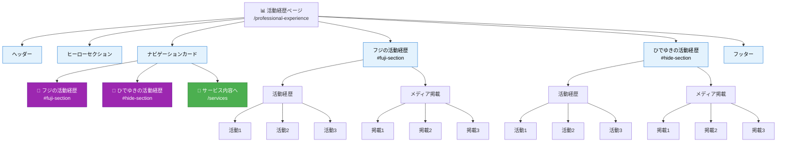
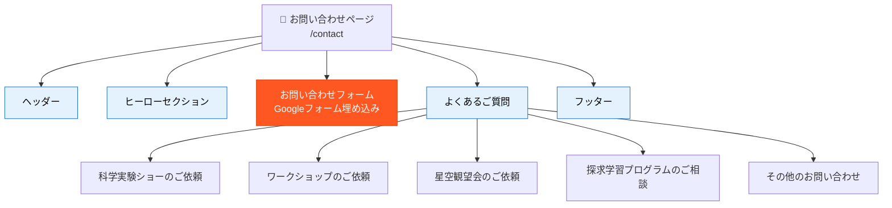

# DONATIサイト 画面遷移図（現状整理）

> **作成日**: 2025年12月27日
> **目的**: デザイナーと共有するための画面遷移仮案を作成し、現在の実装状況と今後のデザイン検討材料を提供する

---

## 📊 現状まとめ

### 実装済みページ（5ページ）
- ✅ `/` - トップページ（OverView）
- ✅ `/services` - サービス内容
- ✅ `/contact` - お問い合わせ
- ✅ `/professional-experience` - 活動経歴
- ✅ `/404` - 準備中ページ

### 未実装（リンクのみ定義済み）
- ⚠️ `/about` - DONATIとは
- ⚠️ `/staff` - 私たちについて
- ⚠️ `/news` - お知らせ

---

## 🚨 課題と検討事項

### 1 フッターの「依頼の流れ」リンク改善

**問題点:**
- 現在 `/services` へのリンクのみ（セクション指定なし）
- ユーザーがページ内の「ご依頼の流れ」セクションまでスクロールする必要がある

**提案:**
- `/services#request-flow` に変更（該当セクションへ直接移動）
- 修正箇所: [Footer.astro](../../src/components/common/Footer.astro) のメニューリンク

### 2. ヘッダーナビゲーションの整理

**現状:**
- ヘッダー5項目中3項目が未実装ページへリンク
  - ✅ サービス内容 → `/services`（実装済み）
  - ✅ お問合せ → `/contact`（実装済み）
  - ⚠️ DONATIとは → `/about`（未実装）
  - ⚠️ 私たちについて → `/about`（未実装）
  - ⚠️ お知らせ → `/news`（未実装）

**提案: 準備中ページへリダイレクト**
- 未実装ページへのリンクを維持
- 404ページまたは「準備中」ページへリダイレクト
- ユーザーに今後のページ追加を予告

### 3. 未実装ページの優先順位

#### 最優先: `/news` - お知らせ一覧・詳細ページ
- **理由**: トップページに既にニュースセクションあり
- **必要な実装**:
  - `/news` - お知らせ一覧ページ
  - `/news/[slug]` - お知らせ詳細ページ（動的ルーティング）
- **microCMS連携**: `News`型で既にデータ取得可能
- **デザイン検討**: 一覧レイアウト、詳細ページのフォーマット

#### 中優先: `/about` - DONATIとは
- **理由**: ブランド理解に重要、ヘッダー・フッター両方からリンクあり
- **コンテンツ案**:
  - DONATIのミッション・ビジョン
  - サイエンスコミュニケーションへの思い
  - 科学と宇宙の魅力を伝える理由
- **デザイン検討**: ストーリーテリング形式、写真・動画の活用

#### 低優先: `/staff` - 私たちについて
- **理由**: `/professional-experience`で既にスタッフ情報あり
- **差別化検討**:
  - `/professional-experience` → 活動経歴・メディア掲載
  - `/staff` → パーソナルな紹介（趣味、好きな実験、メッセージ等）
- **統合案**: `/about`に統合し「私たちについて」セクションとして組み込み

---

## 🏠 トップページ詳細 (`/`)

### 画面遷移図（Mermaid）

```mermaid
graph TD
    Top[🏠 トップページ /] --> Header[ヘッダー]
    Top --> Hero[ヒーローセクション]
    Top --> Carousel[カルーセルセクション]
    Top --> Overview[OverViewセクション]
    Top --> NewsSection[お知らせセクション]
    Top --> Instagram[Instagramセクション]
    Top --> QA[お問い合わせバナー]
    Top --> Footer[フッター]

    %% ヘッダー
    Header --> H1[📖 DONATIとは<br/>/about ⚠️未実装]
    Header --> H2[👥 私たちについて<br/>/about ⚠️未実装]
    Header --> H3[📰 お知らせ<br/>/news ⚠️未実装]
    Header --> H4[🎯 サービス内容<br/>/services]
    Header --> H5[📧 お問合せ<br/>/contact]

    %% OverViewセクション
    Overview --> O1[🎯 依頼の流れカード<br/>/services#request-flow]
    Overview --> O2[❓ よくある質問カード<br/>/services#faq]
    Overview --> O3[📊 活動経歴カード<br/>/achievements ⚠️未実装]

    %% お知らせ
    NewsSection --> N1[ニュース記事1<br/>詳細ページ]
    NewsSection --> N2[ニュース記事2<br/>詳細ページ]
    NewsSection --> N3[ニュース記事3<br/>詳細ページ]
    NewsSection --> N4[ニュース記事4<br/>詳細ページ]

    %% お問い合わせバナー
    QA --> Contact[📧 お問い合わせ<br/>/contact]

    %% フッター
    Footer --> F1[📖 DONATIとは<br/>/about ⚠️未実装]
    Footer --> F2[👥 私たちについて<br/>/staff ⚠️未実装]
    Footer --> F3[📰 お知らせ<br/>/news ⚠️未実装]
    Footer --> F4[🎯 サービス内容<br/>/services]
    Footer --> F5[📋 依頼の流れ<br/>/services 要改善]
    Footer --> F6[📊 活動経歴<br/>/professional-experience]
    Footer --> F7[❓ よくある質問<br/>/services#faq]

    classDef implemented fill:#4CAF50,stroke:#2E7D32,color:#fff
    classDef notImplemented fill:#FF9800,stroke:#E65100,color:#fff
    classDef section fill:#E3F2FD,stroke:#1976D2,color:#000

    class H4,H5,O1,O2,Contact,F4,F6,F7,N1,N2,N3,N4 implemented
    class H1,H2,H3,O3,F1,F2,F3 notImplemented
    class Header,Hero,Carousel,Overview,NewsSection,Instagram,QA,Footer section
```


---

### 色分け凡例

- 🟢 **緑色（実装済みリンク）**: 実装済みページへのリンク
- 🟠 **オレンジ色（未実装リンク）**: 未実装ページへのリンク（⚠️未実装マーク付き）
- 🔵 **水色（セクション）**: ページ内のコンテンツセクション（Header, Footer, Hero等）

---

## 📋 補足情報

### 全体サイトマップ

```mermaid
graph TD
    Start([ユーザー訪問]) --> Home[🏠 トップページ<br/>/]

    %% ヘッダーからの遷移
    Home --> |ヘッダー| Services[🎯 サービス内容<br/>/services]
    Home --> |ヘッダー| Contact[📧 お問い合わせ<br/>/contact]
    Home --> |ヘッダー| About[📖 DONATIとは<br/>/about]
    Home --> |ヘッダー| Staff[👥 私たちについて<br/>/staff]
    Home --> |ヘッダー| News[📰 お知らせ<br/>/news]

    Services --> |ヘッダー| Home
    Services --> |ヘッダー| Contact
    Services --> |ヘッダー| About
    Services --> |ヘッダー| News

    Contact --> |ヘッダー| Home
    Contact --> |ヘッダー| Services
    Contact --> |ヘッダー| About
    Contact --> |ヘッダー| News

    %% トップページの主要ナビゲーション
    Home --> |依頼の流れカード| ServicesFlow[/services#request-flow]
    Home --> |よくある質問カード| ServicesFAQ[/services#faq]
    Home --> |活動経歴カード| Achievements[📊 活動経歴<br/>/achievements]
    Home --> |お問い合わせバナー| Contact

    %% サービスページのページ内遷移
    Services --> |ページ内| Science[#science<br/>サイエンス分野]
    Services --> |ページ内| Space[#space<br/>スペース分野]
    Services --> |ページ内| RequestFlow[#request-flow<br/>ご依頼の流れ]
    Services --> |ページ内| FAQ[#faq<br/>よくある質問]

    %% 活動経歴
    Home --> |フッター| ProfExp[📊 活動経歴<br/>/professional-experience]
    Services --> |ナビカード| Achievements
    ProfExp --> |ページ内| FujiSection[#fuji-section<br/>フジの経歴]
    ProfExp --> |ページ内| HideSection[#hide-section<br/>ひでの経歴]
    ProfExp --> |ナビカード| Services

    %% 404ページ
    NotFound[⚠️ 404ページ<br/>/404] --> |トップへ戻る| Home

    %% 未実装ページ（点線）
    About -.-> |未実装| NotFound
    Staff -.-> |未実装| NotFound
    News -.-> |未実装| NotFound
    Achievements -.-> |統合検討| ProfExp

    %% スタイル定義
    classDef implemented fill:#4CAF50,stroke:#2E7D32,color:#fff
    classDef notImplemented fill:#FF9800,stroke:#E65100,color:#fff
    classDef section fill:#2196F3,stroke:#1565C0,color:#fff
    classDef anchor fill:#9C27B0,stroke:#6A1B9A,color:#fff

    class Home,Services,Contact,ProfExp,NotFound implemented
    class About,Staff,News,Achievements notImplemented
    class Science,Space,RequestFlow,FAQ section
    class FujiSection,HideSection,ServicesFlow,ServicesFAQ anchor
```

### ページ内アンカーリンク一覧

現在実装されているページ内アンカーリンク（スムーズスクロール対応）：

#### `/services` ページ
- `#science` - サイエンス分野セクション
- `#space` - スペース分野セクション
- `#request-flow` - ご依頼の流れセクション
- `#faq` - よくある質問セクション

#### `/professional-experience` ページ
- `#fuji-section` - フジの活動経歴セクション
- `#hide-section` - ひでゆきの活動経歴セクション

これらのアンカーリンクは他のページからも参照可能（例: `/services#faq`）

---

<details>
<summary>📄 各ページの詳細図（クリックで展開）</summary>

### サービスページ詳細図

```mermaid
graph TD
    Services[🎯 サービス内容ページ /services] --> Header[ヘッダー]
    Services --> Hero[ヒーローセクション]
    Services --> ServicesSec[サービスセクション<br/>3列レイアウト]
    Services --> ScienceSec[サイエンス分野<br/>#science]
    Services --> SpaceSec[スペース分野<br/>#space]
    Services --> FlowSec[ご依頼の流れ<br/>#request-flow]
    Services --> FAQSec[よくある質問<br/>#faq]
    Services --> Footer[フッター]

    %% サービスセクション
    ServicesSec --> SS1[サイエンス部門<br/>フジ担当]
    ServicesSec --> SS2[スペース部門<br/>ひで担当]
    ServicesSec --> SS3[ナビゲーションカード]

    SS3 --> Nav1[🎯 依頼の流れ<br/>#request-flow]
    SS3 --> Nav2[❓ よくある質問<br/>#faq]
    SS3 --> Nav3[📊 活動経歴<br/>/achievements ⚠️未実装]

    %% サイエンス分野
    ScienceSec --> Sci1[🧪 サイエンスショー]
    ScienceSec --> Sci2[🔬 科学実験教室]
    ScienceSec --> Sci3[🎨 ワークショップ]

    %% スペース分野
    SpaceSec --> Spa1[⭐ 星空観望会/<br/>プラネタリウム解説]
    SpaceSec --> Spa2[🎓 講演・大学講義]
    SpaceSec --> Spa3[📸 星空風景写真提供]

    %% ご依頼の流れ
    FlowSec --> Flow1[Step1: お問い合わせ]
    FlowSec --> Flow2[Step2: 予算に応じた提案]
    FlowSec --> Flow3[Step3: お見積り提出]
    FlowSec --> Flow4[Step4: ご依頼確定]
    FlowSec --> Flow5[Step5: 出演当日]
    FlowSec --> Flow6[Step6: 支払い方法]

    %% FAQ
    FAQSec --> FAQ1[Q&A 1]
    FAQSec --> FAQ2[Q&A 2]
    FAQSec --> FAQ3[Q&A 3]
    FAQSec --> FAQ4[Q&A 4]
    FAQSec --> FAQ5[Q&A 5]

    classDef section fill:#E3F2FD,stroke:#1976D2,color:#000
    classDef anchor fill:#9C27B0,stroke:#6A1B9A,color:#fff
    classDef notImplemented fill:#FF9800,stroke:#E65100,color:#fff

    class Header,Hero,ServicesSec,ScienceSec,SpaceSec,FlowSec,FAQSec,Footer section
    class Nav1,Nav2 anchor
    class Nav3 notImplemented
```



### 活動経歴ページ詳細図



### お問い合わせページ詳細図



---

## 未実装ページ（リンクのみ定義済み）

### 📖 DONATIとは？ `/about` ⚠️未実装
- Header、Footer両方からリンクあり
- 内容未定義（デザイン検討必要）

### 👥 私たちについて `/staff` ⚠️未実装
- Footerからリンクあり
- 内容未定義（スタッフ紹介ページ？）

### 📰 お知らせ `/news` ⚠️未実装
- Header、Footer両方からリンクあり
- トップページにニュースセクションあり（microCMS連携）
- 一覧ページ・詳細ページの設計必要

### 📊 活動経歴 `/achievements` ⚠️未実装
- `/professional-experience`と統合可能性あり
- 複数箇所からリンクあり（統一検討必要）

---

## 検討が必要な項目

### 1. フッターの「依頼の流れ」リンク
**問題点:**
- 現在 `/services` へのリンクのみ（セクション指定なし）

**提案:**
- `/services#request-flow` に変更（該当セクションへ直接移動）

### 2. 未実装ページの優先順位
**提案優先順位:**
1. `/news` - お知らせ一覧・詳細ページ（ユーザーニーズ高）
2. `/about` - DONATIとは（ブランド理解に重要）
3. `/staff` - スタッフ紹介（信頼性向上）

---

## 次のステップ

### Phase 1: デザイナー確認事項（デザイン側）
1. **未実装ページのデザイン方針決定**
   - `/news` 一覧・詳細ページのレイアウト
   - `/about` ページのコンテンツ構成・ストーリーテリング方針
   - `/staff` ページの必要性（`/about`に統合 vs 独立ページ）

2. **リンク先統一の方針確認**
   - 「活動経歴」リンク統一案への合意
   - Header/Footerナビゲーションの整理方針決定

3. **ページ実装の優先順位合意**
   - `/news` → `/about` → `/staff` の順で実装するか
   - 段階的リリースのタイミング

### Phase 2: エンジニア実装事項（実装側）
1. **リンク先の統一作業**
   - `/achievements` → `/professional-experience` への一括変更
   - Footer「依頼の流れ」リンクに `#request-flow` アンカー追加

2. **未実装ページの優先順位に応じた実装**
   - 最優先: `/news` 一覧・詳細ページ（microCMS連携活用）
   - 中優先: `/about` ページ
   - 低優先: `/staff` ページ（統合案検討後）

3. **ヘッダー・フッターナビゲーションの整合性確保**
   - Header/Footerのリンク先一致確認
   - 未実装ページの扱い決定（削除 or リダイレクト）

### Phase 3: コンテンツ整理（コンテンツ側）
1. **microCMS連携ニュースの詳細ページ設計**
   - 既存`News`型の確認
   - 追加フィールド検討（カテゴリ、タグ等）

2. **各未実装ページのコンテンツ内容定義**
   - `/about` ページの文章・画像素材準備
   - `/staff` ページの情報収集（必要な場合）

---

## 補足: ページ内アンカーリンク一覧

現在実装されているページ内アンカーリンク（スムーズスクロール対応）：

### `/services` ページ
- `#science` - サイエンス分野セクション
- `#space` - スペース分野セクション
- `#request-flow` - ご依頼の流れセクション
- `#faq` - よくある質問セクション

### `/professional-experience` ページ
- `#fuji-section` - フジの活動経歴セクション
- `#hide-section` - ひでゆきの活動経歴セクション

これらのアンカーリンクは他のページからも参照可能（例: `/services#faq`）
