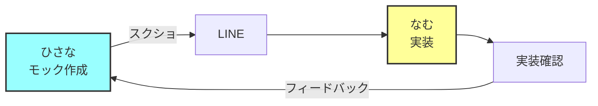
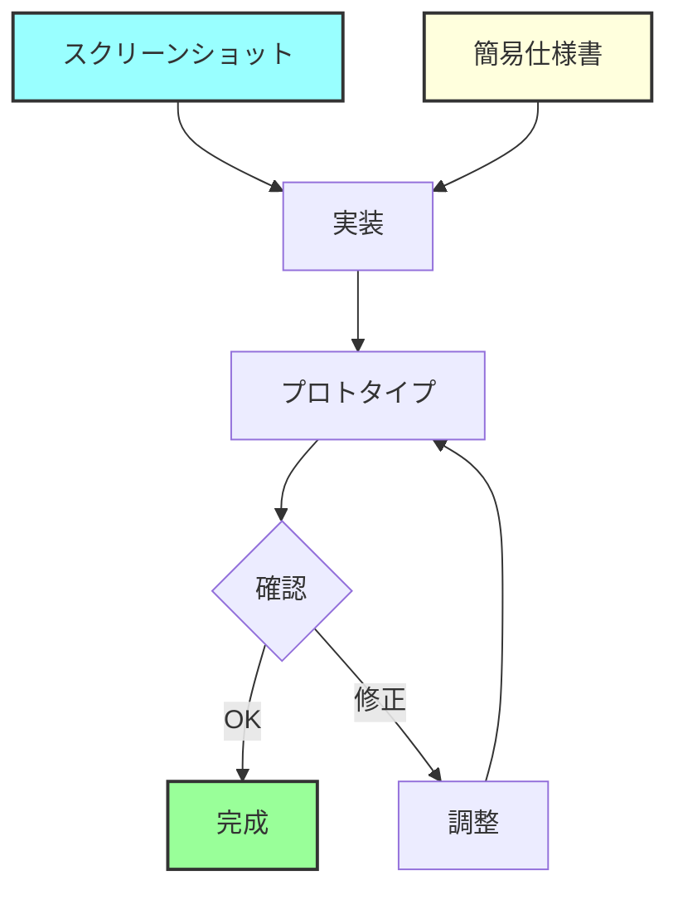

# スクリーンショットベース開発ガイド

## 現状の理解
- デザイナー（ひさな）がモックを作成
- スクリーンショットをLINEで送付
- Figmaは使用していない（不要と決定）

## DONATIプロジェクトの採用ワークフロー
これが主要な開発手法として確定しました。

## 開発アプローチの比較

### A. スクリーンショットのみで進める（採用）



**メリット：**
- ✅ デザイナーの作業が変わらない
- ✅ 追加ツールの学習不要
- ✅ コミュニケーションがシンプル
- ✅ 小規模プロジェクトに最適

**デメリット：**
- ❌ 細かい数値（余白、フォントサイズ）が不明
- ❌ カラーコードの取得が困難
- ❌ レスポンシブデザインの確認が難しい
- ❌ デザインの履歴管理ができない

### B. スクリーンショット + 補助情報

```
デザイナーからもらうもの：
1. スクリーンショット
2. カラーコード一覧
3. フォントサイズ指定
4. 重要な余白の数値
```

**実装例：**
```markdown
## デザイン仕様書

### カラーパレット
- メインブルー: #2c5aa0
- アクセントオレンジ: #f4a261
- テキスト: #333333

### フォントサイズ
- 見出し1: 48px（SP: 32px）
- 見出し2: 32px（SP: 24px）
- 本文: 16px

### 余白
- セクション間: 80px（SP: 40px）
- 要素間: 24px
```

## 推奨アプローチ

### 🎯 現実的な選択：スクリーンショット + 最小限の仕様



### 必要最小限の情報

```yaml
# design-spec.yml
colors:
  primary: "#2c5aa0"    # スクショから抽出
  secondary: "#f4a261"  # スクショから抽出

typography:
  base-size: "16px"
  heading-ratio: 1.5    # 見出しは1.5倍

spacing:
  unit: "8px"           # 8の倍数で設計
  section: "10"         # 80px
  element: "3"          # 24px
```

## HTML→Figma変換について

### 不要な理由

1. **開発フローが逆**
   - 通常: デザイン → 実装
   - 現在: モック → スクショ → 実装
   
2. **工数に見合わない**
   - 変換作業の手間
   - Figmaを使わないなら不要

3. **代替手段で十分**
   - ブラウザの開発者ツール
   - スタイルガイドページ作成

### 代わりに作るべきもの

**1. 簡易スタイルガイドページ**
```html
<!-- /style-guide.html -->
<!DOCTYPE html>
<html>
<head>
    <title>DONATI スタイルガイド</title>
</head>
<body>
    <h1>カラーパレット</h1>
    <div class="color-palette">
        <div style="background: #2c5aa0;">Primary（メインブルー）</div>
        <div style="background: #f4a261;">Secondary（アクセントオレンジ）</div>
    </div>
    
    <h1>タイポグラフィ</h1>
    <h1>見出し1</h1>
    <h2>見出し2</h2>
    <p>本文テキスト</p>
    
    <h1>コンポーネント</h1>
    <!-- 実装したコンポーネントを表示 -->
</body>
</html>
```

**2. スクリーンショット管理**
```
design-screenshots/
├── 2025-01-15/
│   ├── 01-top-page.png
│   ├── 02-top-page-mobile.png
│   └── notes.md
├── 2025-01-20/
│   ├── 01-service-page.png
│   └── changes.md
└── latest/              # 最新版へのシンボリックリンク
```

## 実践的なワークフロー

### 1. スクショ受け取り時の処理

```bash
#!/bin/bash
# scripts/save-screenshot.sh

DATE=$(date +%Y-%m-%d)
COUNTER=1

# ディレクトリ作成
mkdir -p design-screenshots/$DATE

# LINEからダウンロードした画像を保存
echo "画像ファイルをドラッグ&ドロップしてください："
read IMAGE_PATH

# 連番でコピー
cp "$IMAGE_PATH" "design-screenshots/$DATE/$(printf "%02d" $COUNTER)-screenshot.png"

# メモを追加
echo "変更点や注意事項を入力してください："
read NOTES
echo "$NOTES" >> "design-screenshots/$DATE/notes.md"

# 最新版を更新
ln -sfn $DATE design-screenshots/latest

echo "✅ 保存完了！"
```

### 2. カラー抽出ツール

```html
<!-- tools/color-picker.html -->
<!DOCTYPE html>
<html>
<head>
    <title>カラー抽出ツール</title>
</head>
<body>
    <h1>スクリーンショットからカラーを抽出</h1>
    <input type="file" id="imageInput" accept="image/*">
    <canvas id="canvas"></canvas>
    <div id="colorInfo"></div>
    
    <script>
    // スクショをアップロードしてクリックでカラーコード取得
    // 実装は省略
    </script>
</body>
</html>
```

## 友達価格での現実的な提案

### やるべきこと
1. ✅ スクリーンショットで進める
2. ✅ 重要な数値だけLINEで確認
3. ✅ ブラウザでプロトタイプ確認
4. ✅ 細かい調整は対面/画面共有で

### やらなくていいこと
1. ❌ Figmaへの変換
2. ❌ 精密なデザインシステム
3. ❌ 複雑なバージョン管理
4. ❌ 過度なドキュメント化

## デザイナー（ひさな）への依頼テンプレート

```
【お願いしたい情報】

1. メインで使う色のコード
   - 青系: #2c5aa0（確定）
   - オレンジ系: #f4a261（確定）

2. 文字の大きさ
   - 大見出し: 大体○○px
   - 普通の文字: 大体○○px

3. 特にこだわりたい部分
   - 例: ここの余白は広めに
   - 例: この影は必須

4. HTML/CSSファイルがあれば共有お願いします！
   （あれば実装がめちゃくちゃ楽になります）

これくらいで大丈夫です！
細かい部分は実装しながら調整します👍
```

## まとめ

**現状のワークフローで十分です！**

- スクリーンショット + 簡単な仕様 → 実装
- Figma変換は不要（工数に見合わない）
- 必要に応じて簡易ツールで補完

友達同士の仕事なら、**過度なツール導入より、コミュニケーションの良さを活かした方が効率的**です。LINEでサクッと確認できる関係性は大きな強みです。