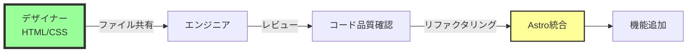
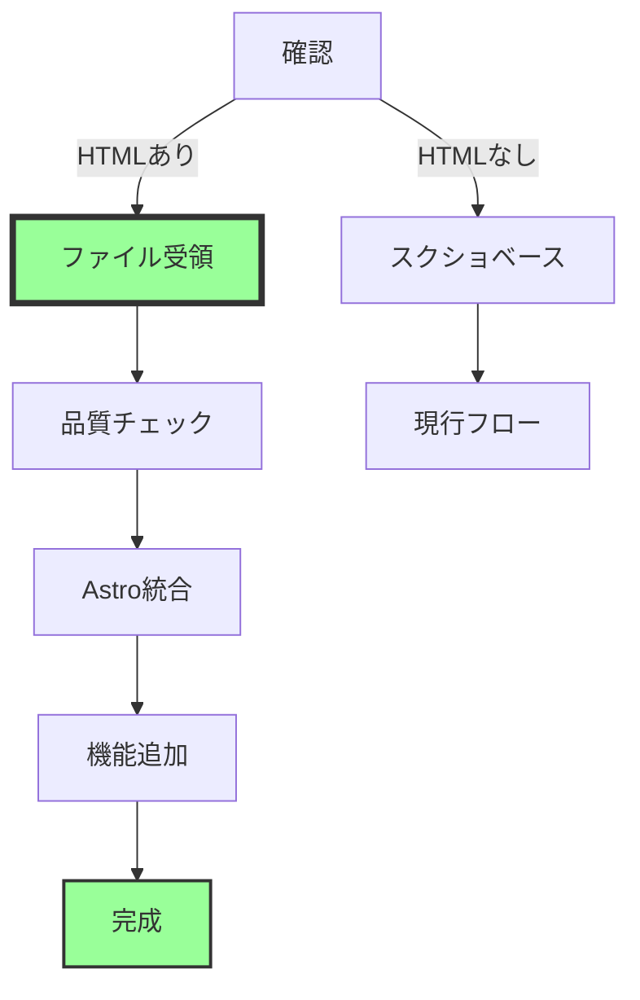

# デザイナーのHTML/CSS活用ガイド

## 重要な気づき
「完成されたWebサイトっぽいスクショ」ということは、デザイナーさんが：
- Adobe XD/Figmaではなく、**実際のHTML/CSSで作成**している可能性
- WebflowやSTUDIOなどの**ノーコードツール**を使用している可能性
- 既に**動くプロトタイプ**を持っている可能性

## 確認すべきこと

### 優先度高：デザイナーへの確認事項

```
【LINEで聞くこと】

そのモックって、もしかして：
1. HTML/CSSで作ってますか？
2. それともデザインツール（XD、Photoshop等）ですか？
3. もしHTMLなら、ファイルをもらえますか？

もしHTMLファイルがあれば、
実装がめちゃくちゃ楽になります！🎉
```

## シナリオ別の対応

### 🎯 シナリオA：HTML/CSSファイルがある場合



**メリット：**
- ✅ **工数が半分以下に削減**
- ✅ デザイン意図が100%反映
- ✅ レスポンシブ対応済みの可能性
- ✅ アニメーションも実装済みかも

**作業内容：**
```bash
# 1. HTMLファイルを受け取る
design-html/
├── index.html
├── styles.css
├── images/
└── js/

# 2. Astroコンポーネントに変換
src/
├── components/
│   └── (HTMLから抽出したコンポーネント)
└── pages/
    └── index.astro (変換後)
```

### 🔧 シナリオB：ノーコードツール使用の場合

**よくあるツール：**
- Webflow
- STUDIO
- Wix
- WordPress + Elementor

**対応方法：**
1. **エクスポート機能を確認**
   ```
   多くのツールはHTML/CSSエクスポート可能：
   - Webflow → 有料プランでエクスポート
   - STUDIO → HTMLダウンロード機能あり
   ```

2. **ブラウザから直接取得**
   ```bash
   # Chrome DevToolsで「Save as...」
   # または wget/curlでページ保存
   wget -p -k https://example.com/mockup
   ```

### 📐 シナリオC：デザインツールの場合

そのまま現在の「スクショベース開発」を継続。

## HTML/CSSがある場合の統合手順

### 1. コード品質の確認

```javascript
// scripts/analyze-html.js
const htmlFiles = ['index.html', 'about.html'];

htmlFiles.forEach(file => {
  // 構造チェック
  checkSemanticHTML(file);
  // アクセシビリティ
  checkA11y(file);
  // パフォーマンス
  checkImageOptimization(file);
});
```

### 2. Astroへの変換

**変換前（HTML）：**
```html
<!DOCTYPE html>
<html>
<head>
    <link rel="stylesheet" href="styles.css">
</head>
<body>
    <header>
        <nav>...</nav>
    </header>
    <main>
        <section class="hero">...</section>
    </main>
</body>
</html>
```

**変換後（Astro）：**
```astro
---
// src/pages/index.astro
import Layout from '../layouts/Layout.astro';
import Header from '../components/Header.astro';
import Hero from '../components/Hero.astro';
---

<Layout>
  <Header />
  <main>
    <Hero />
  </main>
</Layout>
```

### 3. スタイルの整理

```scss
// 元のCSS
.hero {
  background: blue;
  padding: 50px;
}

// Astroコンポーネント内に移動
<style>
  .hero {
    background: var(--primary-color);
    padding: var(--spacing-hero);
  }
</style>
```

## 確認用チェックリスト

### デザイナーに確認
- [ ] モックの作成方法は？
- [ ] HTMLファイルはある？
- [ ] CSSファイルはある？
- [ ] JavaScriptはある？
- [ ] 画像の元ファイルはある？
- [ ] レスポンシブ対応済み？
- [ ] 使用したツール/フレームワークは？

### もらったら確認
- [ ] 文字化けしていない？
- [ ] 画像パスは正しい？
- [ ] CSSは外部ファイル？インライン？
- [ ] JavaScriptの依存関係は？
- [ ] フォントの指定は？

## 価格への影響

### HTML/CSSがある場合の工数削減

```
通常の工数：
- デザイン確認: 5時間
- HTML/CSS実装: 20時間
- レスポンシブ対応: 10時間
合計: 35時間

HTML/CSSありの場合：
- コード確認: 2時間
- Astro統合: 8時間
- 調整: 5時間
合計: 15時間（57%削減！）
```

### 修正価格案
- エンジニア工数: 28-35万円 → **15-20万円**
- 全体: 53-70万円 → **40-55万円**

## アクションプラン

### 今すぐやること
1. **デザイナーに確認のLINE**
   ```
   「モックってHTMLで作ってますか？
   もしそうなら、ファイルもらえると
   実装がすごく楽になります！」
   ```

2. **返答によって方針決定**
   - HTMLあり → 統合作業メイン
   - HTMLなし → 現行のスクショベース継続

### 理想的な流れ



## まとめ

**デザイナーさんがHTML/CSSを持っている可能性は高い！**

もし持っていれば：
- 🚀 開発スピード2倍
- 💰 コスト削減可能
- 🎯 デザイン再現度100%

まずは**確認の一言**から始めましょう。これが最も効率的な次の一手です。