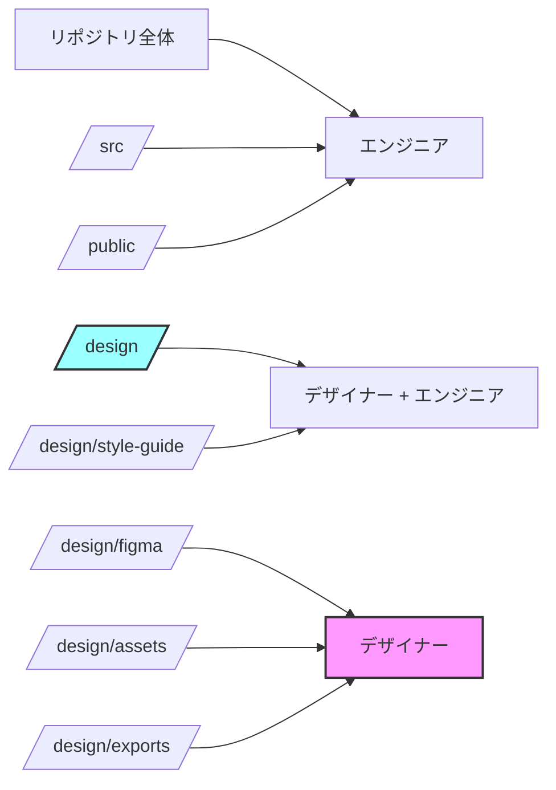
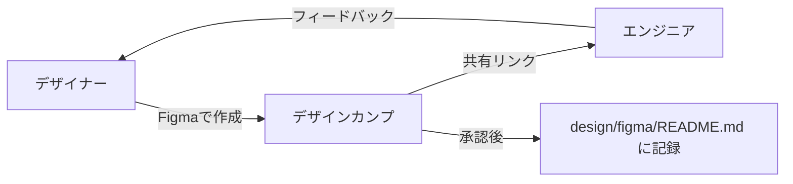
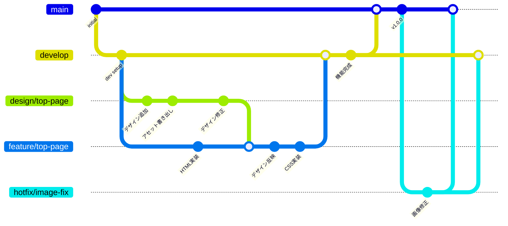
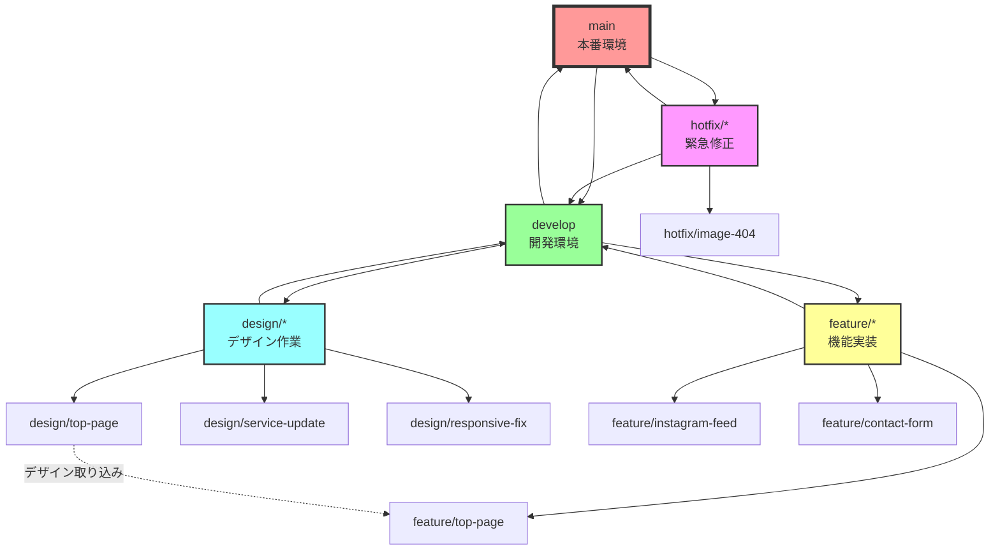

> **注意**: このドキュメントは協業のための理想的なディレクトリ構成の提案です。
> 実際のDONATIプロジェクトの構成は異なります。
> 現在のプロジェクト構成は `CLAUDE.md` の「ディレクトリ構成」セクションを参照してください。

---

# デザイナーとの協業ガイド - ソース管理編（2025年版）

## 概要
デザイナー（ひさな）とエンジニア（なむ）が効率的に協業するためのソース管理方法とワークフローの提案。

## 現在の推奨ワークフロー
**スクリーンショットベース開発を採用（決定事項：Figma不要）**

## 1. 実際のツールスタック

### 1.1 デザイン共有方法
- **LINE + スクリーンショット**（採用中）
  - 迅速なフィードバック
  - 追加ツール不要
  - 友達同士の利点を活用
  
- **HTML/CSS直接提供**（推奨）
  - ひさなさんがHTML/CSS作成可能な場合
  - 工数を最大57%削減可能

### 1.2 デザインアセット管理
- **GitHub + Git LFS**
  - 大容量ファイル（PSD、AI）の管理
  - バージョン管理
  - ブランチ運用可能

### 1.3 コミュニケーション
- **GitHub Issues/Pull Requests**
  - デザインレビュー
  - 実装確認
  - フィードバック管理

## 2. ディレクトリ構造

### 2.1 基本構造

```
donati-website/
├── design/                    # デザイン関連ファイル
│   ├── figma/                # Figmaファイルのリンク集
│   │   └── README.md         # 各画面のFigmaリンク
│   ├── assets/               # デザインアセット
│   │   ├── logos/           # ロゴファイル（SVG推奨）
│   │   ├── icons/           # アイコンセット
│   │   ├── illustrations/   # イラスト素材
│   │   └── photos/          # 写真素材（オリジナル）
│   ├── exports/              # 書き出し済みアセット
│   │   ├── images/          # 最適化前の画像
│   │   └── graphics/        # その他のグラフィック
│   └── style-guide/          # スタイルガイド
│       ├── colors.md        # カラーパレット
│       ├── typography.md    # タイポグラフィ
│       └── components.md    # UIコンポーネント
├── public/
│   └── images/               # 最適化済み本番用画像
└── src/
    └── assets/               # 開発用アセット
```

### 2.2 詳細なプロジェクト階層（Mermaid）

```mermaid
graph TD
    A[donati-website/] --> B[.git/]
    A --> C[.github/]
    A --> D[design/]
    A --> E[public/]
    A --> F[src/]
    A --> G[scripts/]
    A --> H[ドキュメント類]
    
    C --> C1[workflows/]
    C --> C2[pull_request_template.md]
    C --> C3[CODEOWNERS]
    
    D --> D1[figma/]
    D --> D2[assets/]
    D --> D3[exports/]
    D --> D4[style-guide/]
    
    D1 --> D11[README.md<br/>Figmaリンク集]
    
    D2 --> D21[logos/]
    D2 --> D22[icons/]
    D2 --> D23[illustrations/]
    D2 --> D24[photos/]
    
    D21 --> D211[donati-logo.svg]
    D21 --> D212[donati-logo.ai]
    
    D3 --> D31[images/]
    D3 --> D32[graphics/]
    
    D31 --> D311[hero-bg.jpg]
    D31 --> D312[hero-bg@2x.jpg]
    D31 --> D313[service-*.png]
    
    E --> E1[images/]
    E --> E2[fonts/]
    
    E1 --> E11[optimized/]
    E1 --> E12[hero-bg.webp]
    E1 --> E13[hero-bg.jpg]
    
    F --> F1[components/]
    F --> F2[pages/]
    F --> F3[assets/]
    F --> F4[styles/]
    
    F3 --> F31[images/]
    F3 --> F32[icons/]
    
    G --> G1[optimize-images.sh]
    G --> G2[sync-design-assets.sh]
    G --> G3[build-icons.js]
    
    H --> H1[README.md]
    H --> H2[package.json]
    H --> H3[.gitignore]
    H --> H4[.gitattributes]
    
    style A fill:#f9f,stroke:#333,stroke-width:4px
    style D fill:#9ff,stroke:#333,stroke-width:2px
    style E fill:#ff9,stroke:#333,stroke-width:2px
    style F fill:#9f9,stroke:#333,stroke-width:2px
```

### 2.3 Git LFS 対象ファイル（.gitattributes）

```gitattributes
# デザインアセット
*.psd filter=lfs diff=lfs merge=lfs -text
*.ai filter=lfs diff=lfs merge=lfs -text
*.sketch filter=lfs diff=lfs merge=lfs -text
*.fig filter=lfs diff=lfs merge=lfs -text

# 高解像度画像
*.jpg filter=lfs diff=lfs merge=lfs -text
*.jpeg filter=lfs diff=lfs merge=lfs -text
*.png filter=lfs diff=lfs merge=lfs -text
*.tiff filter=lfs diff=lfs merge=lfs -text

# 動画ファイル
*.mp4 filter=lfs diff=lfs merge=lfs -text
*.mov filter=lfs diff=lfs merge=lfs -text

# フォントファイル
*.otf filter=lfs diff=lfs merge=lfs -text
*.ttf filter=lfs diff=lfs merge=lfs -text
```

### 2.4 アクセス権限の階層（CODEOWNERS）



**CODEOWNERS ファイル例：**
```
# デフォルトオーナー
* @engineer-username

# デザイン関連
/design/ @designer-username @engineer-username
/design/figma/ @designer-username
/design/assets/ @designer-username
/design/exports/ @designer-username
/design/style-guide/ @designer-username @engineer-username

# 自動生成ファイル
/public/images/ @engineer-username
```

## 3. ワークフロー

### 3.1 初期設計フェーズ



**手順：**
1. デザイナーがFigmaでデザイン作成
2. 共有リンクをREADMEに記載
3. GitHubにプッシュ
4. エンジニアがレビュー

**design/figma/README.md の例：**
```markdown
# Figmaデザインリンク集

## ページデザイン
- [トップページ](https://www.figma.com/file/xxx) - 更新日: 2025/01/15
- [サービスページ](https://www.figma.com/file/yyy) - 更新日: 2025/01/16
- [お問い合わせ](https://www.figma.com/file/zzz) - 更新日: 2025/01/17

## コンポーネント
- [UIコンポーネント集](https://www.figma.com/file/aaa)
- [アイコンセット](https://www.figma.com/file/bbb)
```

### 3.2 アセット書き出しフェーズ

**デザイナーの作業：**
1. Figmaから必要なアセットを書き出し
2. `design/exports/` に配置
3. 命名規則に従ってファイル名を設定
4. GitHubにプッシュ

**命名規則：**
```
# 画像
hero-background.jpg          # ヒーロー背景
service-icon-experiment.svg  # サービスアイコン（実験）
achievement-photo-001.jpg    # 実績写真

# レスポンシブ画像
hero-background@2x.jpg      # 高解像度版
hero-background-mobile.jpg  # モバイル版
```

### 3.3 実装フェーズ

**エンジニアの作業：**
1. `design/exports/` から画像を取得
2. 最適化処理（後述）
3. `public/images/` に配置
4. 実装完了後、プルリクエスト作成

**画像最適化スクリプト例：**
```bash
#!/bin/bash
# scripts/optimize-images.sh

# JPG画像の最適化
for img in design/exports/images/*.jpg; do
  filename=$(basename "$img")
  # WebP変換
  cwebp -q 80 "$img" -o "public/images/${filename%.jpg}.webp"
  # JPG圧縮
  jpegoptim --max=80 --strip-all --dest="public/images/" "$img"
done

# PNG画像の最適化
for img in design/exports/images/*.png; do
  filename=$(basename "$img")
  # WebP変換
  cwebp -q 90 "$img" -o "public/images/${filename%.png}.webp"
  # PNG圧縮
  pngquant --quality=80-90 --output "public/images/$filename" "$img"
done
```

## 4. Git運用ルール

### 4.1 ブランチ戦略

```
main
├── design/header-update     # デザイナー作業ブランチ
├── feature/header-impl      # エンジニア実装ブランチ
└── hotfix/image-optimize    # 緊急修正
```

### 4.2 コミットメッセージ規則

**デザイナー：**
```bash
design: トップページのヒーローセクションデザイン追加
design: カラーパレット更新（アクセントカラー追加）
design: モバイル版レイアウト調整
```

**エンジニア：**
```bash
feat: ヒーローセクション実装
fix: 画像の表示サイズ調整
optimize: 画像をWebP形式に変換
```

### 4.3 プルリクエストテンプレート

**.github/pull_request_template.md:**
```markdown
## 変更内容
- [ ] デザイン追加/更新
- [ ] アセット追加/更新
- [ ] 実装
- [ ] バグ修正

## デザイン変更の場合
- Figmaリンク: 
- 影響範囲: 
- 確認事項: 

## 実装の場合
- 対応デザイン: 
- 動作確認済み環境: 
  - [ ] Chrome
  - [ ] Safari
  - [ ] Mobile

## スクリーンショット
変更前：
変更後：
```

## 5. ブランチ運用の詳細

### 5.1 ブランチ階層図



### 5.2 ブランチ命名規則とフロー



## 6. 非技術系デザイナー向けの簡易運用

### 6.1 GitHub Desktop を使用

1. **初期設定（エンジニアがサポート）**
   - GitHub Desktop インストール
   - リポジトリをクローン
   - 基本操作のレクチャー（30分程度）

2. **デザイナーの日常作業**
   ```
   1. GitHub Desktop で "Fetch origin" をクリック
   2. design/exports/ にファイルを追加
   3. "Commit to main" に説明を記入
   4. "Push origin" をクリック
   ```

### 6.2 クラウドストレージ連携案

**Google Drive/Dropbox を使用：**
```
1. 共有フォルダを作成
2. デザイナーがアセットをアップロード
3. エンジニアが定期的に取り込み
4. GitHubに反映
```

**自動同期スクリプト例：**
```bash
#!/bin/bash
# scripts/sync-design-assets.sh

# Google Drive から同期（rclone使用）
rclone sync "gdrive:DONATI_Design/exports" "design/exports/"

# 新規ファイルを Git に追加
git add design/exports/
git commit -m "design: Google Driveからアセット同期 $(date +%Y-%m-%d)"
git push
```

## 7. レビューとフィードバック

### 7.1 デザインレビュー

**Figma内でのコメント：**
- 具体的な箇所にピン留め
- @メンションで通知
- 解決済みはResolve

**GitHub Issues での管理：**
```markdown
### デザイン修正依頼 #12

**該当箇所**: トップページのヒーローセクション
**Figmaリンク**: https://www.figma.com/file/xxx#node-id=123

**修正内容**:
- [ ] フォントサイズを24pxに変更
- [ ] 余白を40pxに調整
- [ ] モバイル版の改行位置を修正

**期限**: 2025/01/20
```

### 7.2 実装レビュー

**Vercelプレビューの活用：**
1. プルリクエスト作成時に自動デプロイ
2. プレビューURLをデザイナーに共有
3. 実際の表示を確認してフィードバック

## 8. トラブルシューティング

### 8.1 よくある問題

**Q: Git LFS の容量制限に到達**
```bash
# 不要な履歴を削除
git lfs prune
# 古いファイルを通常のGit管理から除外
git rm --cached design/assets/old-file.psd
```

**Q: Figmaの画像書き出しが粗い**
- 書き出し設定を確認（2x, 3xオプション）
- SVG形式での書き出しを検討
- エンジニア側で高品質化処理

**Q: コンフリクトが発生**
- デザインファイルは基本的に上書き採用
- 実装ファイルは慎重にマージ
- 不明な場合は必ずSlack/Discord で相談

### 8.2 緊急時の対応

```markdown
## 緊急修正フロー
1. hotfix ブランチを作成
2. 最小限の修正を実施
3. デザイナー・エンジニア双方で確認
4. 即座にmainにマージ
5. 他のブランチにも反映
```

## 9. ベストプラクティス

### 9.1 DO
- ✅ 毎日の作業開始時に`git pull`
- ✅ こまめなコミット（1日1回以上）
- ✅ 分かりやすいファイル名
- ✅ 不明点は即座に質問
- ✅ プレビュー環境での確認

### 9.2 DON'T
- ❌ 巨大なPSDファイルを直接コミット
- ❌ node_modules をコミット
- ❌ 他人の作業ブランチを勝手に変更
- ❌ mainブランチに直接大きな変更
- ❌ バイナリファイルの頻繁な更新

## 10. 効率化のための追加ツール

### 10.1 デザイントークン
**Style Dictionary の活用：**
```json
{
  "color": {
    "primary": { "value": "#2c5aa0" },
    "secondary": { "value": "#f4a261" }
  },
  "spacing": {
    "small": { "value": "8px" },
    "medium": { "value": "16px" }
  }
}
```

### 10.2 自動化ツール
- **Figma Tokens**: デザイントークンの同期
- **Figma to Code**: コンポーネント自動生成
- **ImageOptim API**: 画像最適化の自動化

## まとめ

デザイナーとエンジニアの効率的な協業には、適切なツール選択と明確なワークフローが不可欠です。技術レベルに応じて段階的に導入し、チーム全体の生産性向上を目指しましょう。

最も重要なのは、**コミュニケーション**と**相互理解**です。お互いの専門性を尊重しながら、より良いプロダクトを作り上げていきましょう。