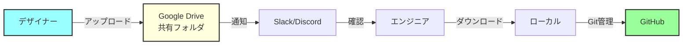
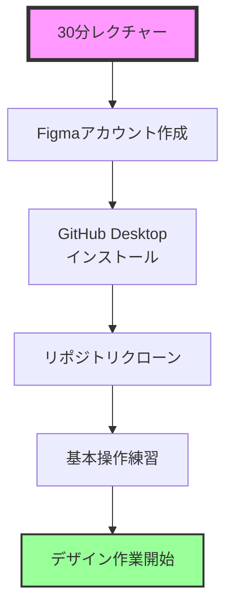
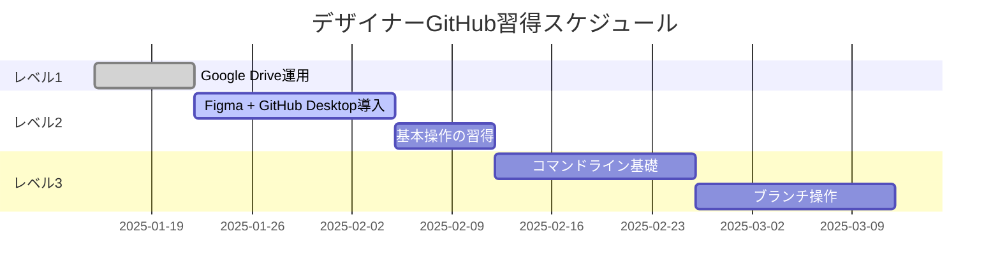

# GitHub未経験デザイナーのための協業ガイド

## 概要
GitHubを使ったことがないデザイナーさんと効率的に協業するための段階的アプローチ。

## レベル別アプローチ

### 🟢 レベル1: クラウドストレージ共有（即日開始可能）

#### 使用ツール
- **Google Drive** または **Dropbox**
- **Slack** または **Discord**

#### ワークフロー



#### フォルダ構成例
```
DONATI_Design（Google Drive）/
├── 01_デザイン/
│   ├── 2025-01-15_トップページ/
│   │   ├── design.fig
│   │   └── design_v2.fig
│   └── 2025-01-20_サービスページ/
├── 02_書き出し画像/
│   ├── 確定版/
│   │   ├── hero-bg.jpg
│   │   └── service-icons.svg
│   └── 仮/
└── 03_スタイルガイド/
    └── カラーパレット.pdf
```

#### 運用ルール
1. **命名規則**
   ```
   日付_ファイル名_バージョン.拡張子
   例: 2025-01-15_hero-bg_v2.jpg
   ```

2. **フォルダ管理**
   - 確定版と仮版を分ける
   - 日付フォルダで履歴管理

3. **連絡方法**
   ```
   【Slackメッセージ例】
   @エンジニア
   トップページのデザインを更新しました！
   📁 01_デザイン/2025-01-15_トップページ/
   変更点：ヒーローセクションの文字サイズ調整
   ```

### 🟡 レベル2: Figma + 簡易ツール（1週間で習得）

#### 使用ツール
- **Figma**（ブラウザ版）
- **GitHub Desktop**（GUIツール）
- **Visual Studio Code**（ファイル確認用）

#### 初期セットアップ（エンジニアがサポート）



#### 簡単な操作手順

**1. Figmaでの作業**
```
1. ブラウザでFigmaを開く
2. デザインを作成・編集
3. 共有リンクをコピー
```

**2. GitHub Desktopでの作業**
```
1. "Fetch origin"ボタンをクリック（最新を取得）
2. design/figma/README.md を開く
3. Figmaリンクを追加
4. 画像をdesign/exports/に保存
5. "Commit to main"に説明を入力
6. "Push origin"をクリック
```

**3. 視覚的な操作ガイド**
```markdown
# GitHub Desktop 操作ガイド

## 毎日の作業開始時
1. 🔄 "Fetch origin" をクリック
2. ✅ 緑色のチェックマークを確認

## ファイルを追加したら
1. 📝 下部の入力欄に説明を記入
   例: "トップページのヒーロー画像を追加"
2. 💙 "Commit to main" をクリック
3. ⬆️ "Push origin" をクリック

## 困ったときは
- 赤い❌マークが出たら → Slackでエンジニアに連絡
- 分からないことがあったら → 遠慮なく質問
```

### 🔵 レベル3: コマンドライン導入（1ヶ月後）

#### 段階的な学習

**第1週: 基本コマンドのみ**
```bash
# これだけ覚える
git status          # 状態確認
git add .           # 全部追加
git commit -m "説明" # 保存
git push            # 送信
```

**第2週: ブランチ操作**
```bash
git checkout -b design/new-feature  # 新しいブランチ
git checkout main                   # メインに戻る
```

## エンジニア側のサポート体制

### 1. 自動化スクリプトの準備

**sync-from-cloud.sh**
```bash
#!/bin/bash
# Google Driveから自動同期

echo "🔄 デザインファイルを同期中..."

# rcloneでGoogle Driveから同期
rclone sync "gdrive:DONATI_Design/02_書き出し画像/確定版" "design/exports/"

# 新規ファイルをGitに追加
git add design/exports/

# 変更があればコミット
if [ -n "$(git status --porcelain)" ]; then
    git commit -m "design: Google Driveから画像を同期 $(date +%Y-%m-%d)"
    echo "✅ 同期完了！"
else
    echo "ℹ️ 新しいファイルはありません"
fi
```

### 2. デザイナー専用コマンド

**.bashrc または .zshrc に追加**
```bash
# デザイナー向けエイリアス
alias design-update="git pull && echo '✅ 最新版を取得しました'"
alias design-save="git add . && git commit -m '$(date +%Y-%m-%d) デザイン更新' && git push && echo '✅ 保存完了'"
alias design-status="git status"
```

### 3. トラブルシューティングガイド

```markdown
## よくあるトラブルと対処法

### 🚨 "Permission denied"
→ **対処**: Slackで「権限エラーが出ました」と連絡

### 🚨 "Merge conflict"
→ **対処**: 触らずにSlackで「コンフリクトが発生」と連絡

### 🚨 ファイルが大きすぎる
→ **対処**: 画像を圧縮するか、Google Driveに置く

### 💡 便利なTips
- 不安なときは、フォルダごとバックアップを取る
- 間違えても`git reset --hard`で元に戻せる（エンジニアが対応）
```

## 移行スケジュール例



## チェックリスト

### デザイナー向け
- [ ] Google Driveの共有フォルダにアクセスできる
- [ ] Slackで連絡が取れる
- [ ] Figmaアカウントを作成した
- [ ] GitHub Desktopをインストールした
- [ ] 最初のコミットができた

### エンジニア向け
- [ ] 共有フォルダの設定完了
- [ ] 自動同期スクリプトの設定
- [ ] デザイナーへのレクチャー（30分）
- [ ] トラブル時のサポート体制確立
- [ ] 定期的なフォローアップ予定

## まとめ

GitHub未経験でも大丈夫！まずは**レベル1のクラウドストレージ共有**から始めて、徐々にステップアップしていきましょう。エンジニアが全面的にサポートします。

重要なのは：
1. 📁 **整理されたファイル管理**
2. 💬 **こまめなコミュニケーション**
3. 🚀 **段階的な学習**

一緒に効率的なワークフローを作っていきましょう！