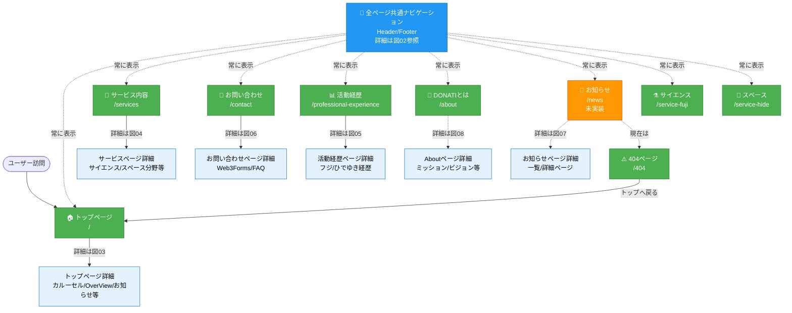

# サイト構造概要

DONATIサイト全体のページ構成と関係性を示す俯瞰図です。

## 📊 全体サイトマップ

---

## ページ一覧

### ✅ 実装済みページ（8ページ）

| ページ | URL | 説明 |
|--------|-----|------|
| トップページ | `/` | サイトの入口、OverViewセクション、お知らせ、Instagram等 |
| DONATIとは | `/about` | ブランド概要、スタッフ紹介 |
| サービス内容 | `/services` | サイエンス/スペース分野の統合ページ |
| サイエンス | `/service-fuji` | サイエンス専用ページ（Issue #77） |
| スペース | `/service-hide` | 宇宙/天文専用ページ（Issue #77） |
| 活動経歴 | `/professional-experience` | フジ/ひでゆきの活動経歴・メディア掲載 |
| お問い合わせ | `/contact` | Web3Forms、よくあるご質問 |
| 404ページ | `/404` | 準備中ページ、トップページへ戻るリンク |

### ⚠️ 未実装ページ（1ページ）

| ページ | URL | 現在の挙動 | 優先度 |
|--------|-----|-----------|--------|
| お知らせ | `/news` | 404ページへ | 高（microCMS連携済み） |

---

## 重要な設計ポイント

### 1. 全ページ共通ナビゲーション
全ページのHeader/Footerから他のページにアクセス可能です。
詳細は **[02_共通ナビゲーション.md](./02_共通ナビゲーション.md)** を参照してください。

### 2. ユーザージャーニー
CVR重視の主要導線は **[01_ユーザージャーニー.md](./01_ユーザージャーニー.md)** を参照してください。

### 3. 各ページ詳細
- [03_トップページ詳細.md](./03_トップページ詳細.md)
- [04_サービスページ詳細.md](./04_サービスページ詳細.md)
- [05_活動経歴ページ詳細.md](./05_活動経歴ページ詳細.md)
- [06_お問い合わせページ詳細.md](./06_お問い合わせページ詳細.md)
- [07_お知らせページ詳細.md](./07_お知らせページ詳細.md)（未実装）
- [08_Aboutページ詳細.md](./08_Aboutページ詳細.md)（未実装）

---

## 色分け凡例

- 🟢 **緑色**: 実装済みページ
- 🟠 **オレンジ色**: 未実装ページ
- 🔵 **青色**: 共通ナビゲーション
- 🔵 **水色**: 詳細図へのリンク

---

## 最終更新

- **作成日**: 2025年12月27日
- **最終更新**: 2025年12月28日
