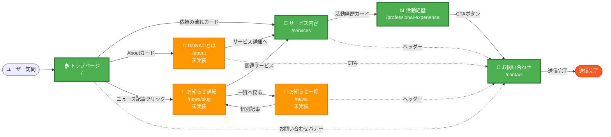

# ユーザージャーニー図

CVR（Conversion Rate）重視の主要導線を可視化した、デザイナー向けの図です。

## 🎯 CVR導線の全体像



---

## 主要ジャーニーの詳細

### 1. メインジャーニー（CVRゴール）

**目的**: お問い合わせ完了までの最短導線

```
ユーザー訪問
  ↓
🏠 トップページ
  ↓ 「依頼の流れ」カードクリック
🎯 サービス内容
  ↓ 「活動経歴」カードクリック
📊 活動経歴（信頼獲得）
  ↓ CTAボタン
📧 お問い合わせ
  ↓ フォーム送信
✅ 送信完了
```

**重要なCTA配置箇所:**
- トップページ: 「依頼の流れ」カード（OverViewセクション）
- サービスページ: 「活動経歴」カード（ナビゲーションカード）
- 活動経歴ページ: お問い合わせCTAボタン
- 全ページ: ヘッダーの「お問合せ」アイコン

---

### 2. サブジャーニー（信頼獲得）

**目的**: DONATIを知ってもらい、サービスへ誘導

```
🏠 トップページ
  ↓ 「DONATIとは」カードクリック
📖 DONATIとは（ミッション/ビジョン）
  ↓ サービス詳細へのリンク
🎯 サービス内容
  ↓ メインジャーニーに合流
```

**現状**: `/about`ページは未実装（優先度: 中）

---

### 3. 補助ジャーニー（情報収集）

**目的**: お知らせ記事からサービスへの導線

```
🏠 トップページ
  ↓ ニュース記事クリック
📰 お知らせ詳細ページ
  ↓ 関連サービスリンク
🎯 サービス内容
  ↓ メインジャーニーに合流
```

**現状**: `/news`および`/news/[slug]`は未実装（優先度: 高）

---

## どこからでもお問い合わせへ（補助CTA）

全ページから常にお問い合わせにアクセス可能:

- **トップページ**: お問い合わせバナー（QA.svg）
- **全ページ**: ヘッダーの「お問合せ」アイコン
- **全ページ**: フッターの「お問い合わせ」リンク

---

## デザイナー向けポイント

### CVR向上のためのCTA配置

#### トップページ
- **主要CTA**: 「依頼の流れ」カード（OverViewセクション中央）
- **補助CTA**: お問い合わせバナー（ページ下部）
- **背景CTA**: ヘッダー「お問合せ」（全ページ共通）

#### サービスページ
- **主要CTA**: 「活動経歴」カード（ナビゲーションカード）
- **補助CTA**: ヘッダー「お問合せ」

#### 活動経歴ページ
- **主要CTA**: お問い合わせCTAボタン（フジ/ひでゆき経歴の後）
- **補助CTA**: ヘッダー「お問合せ」

---

## 導線の優先度

| 優先度 | ジャーニー | 現状 | 備考 |
|--------|-----------|------|------|
| 🔴 最優先 | Home → Services → ProfExp → Contact | ✅ 実装済み | メインCVR導線 |
| 🟠 高 | Home → NewsDetail → Services | ⚠️ 未実装 | microCMS連携活用 |
| 🟡 中 | Home → About → Services | ⚠️ 未実装 | ブランド理解 |
| 🟢 低 | どこからでも → Contact | ✅ 実装済み | 補助CTA |

---

## 未実装ページの影響

### `/news`（お知らせ）- 優先度: 高
- **影響**: トップページのニュース記事が詳細ページへリンクできない
- **対策**: microCMS連携を活用し、一覧/詳細ページを実装

### `/about`（DONATIとは）- 優先度: 中
- **影響**: ブランド理解の機会損失、ヘッダー/フッターリンクが404へ
- **対策**: ミッション/ビジョンページを実装

---

## 色分け凡例

- **🟢 緑色（太枠）**: メインジャーニー（CVRゴール）
- **🔵 青色**: サブジャーニー（信頼獲得）
- **🟠 オレンジ色**: 未実装ページ
- **🔴 赤色**: CTA完了（送信完了）
- **点線**: 補助CTA（どこからでもContactへ）

---

## 最終更新

- **作成日**: 2025年12月27日
- **最終更新**: 2025年12月27日
- **対象読者**: デザイナー、ディレクター
